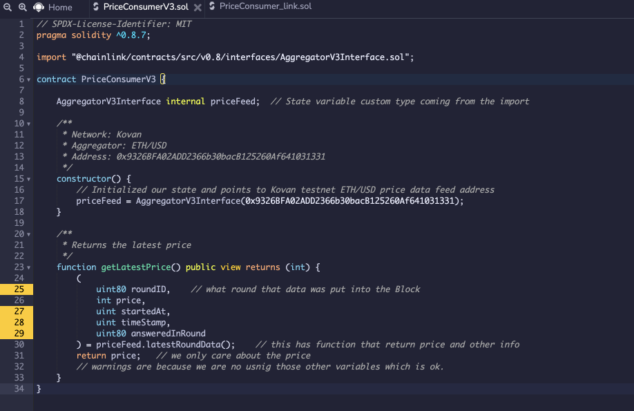
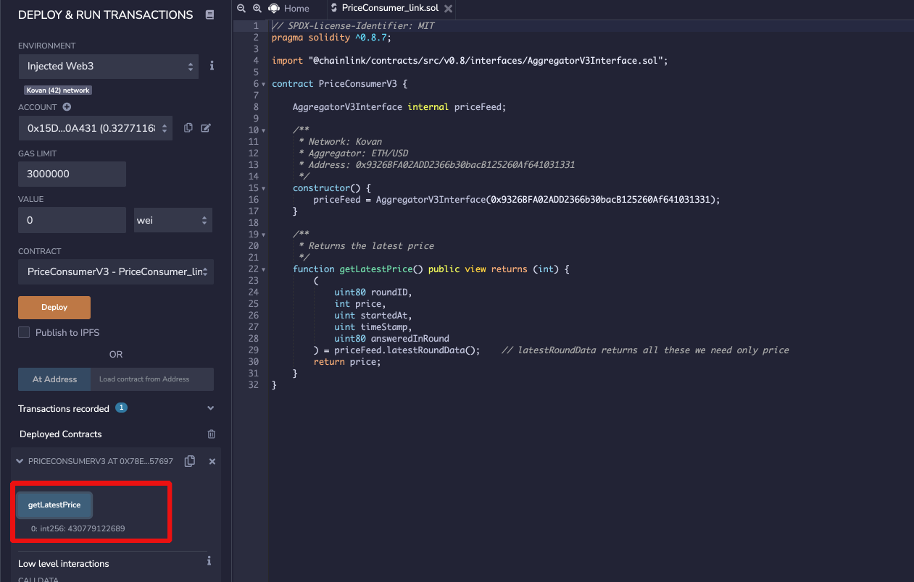
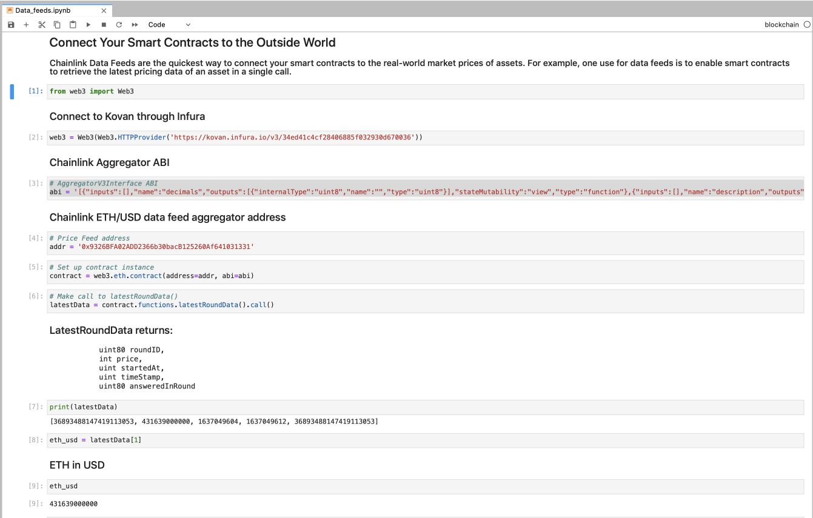

# Chainlink Oracles

Connect Your Smart Contracts to the Outside World

Chainlink Data Feeds are the quickest way to connect your smart contracts to the real-world market prices of assets. For example, one use for data feeds is to enable smart contracts to retrieve the latest pricing data of an asset in a single call.

1. **Wrote a Smart contract in Remix using Solidity that will get Data feed for market price for ETH/USD using Chainlink Oracles.**
2. **Used WEb3 python to connect to the Chainlink data feed aggregator to also get the ETH/USD price.**

## **Smart contract to get Chainlink oracle data feed**

Below is solidity code deployed.

https://gist.github.com/rchak007/ce16b7fcc668ac8b166212d462dd87c8

Transaction:

https://kovan.etherscan.io/tx/0x286dcc71944178d866ef6454d3e5421c65730455e97c77736f0befb372aec212

Smart Contract - 0x78E29cb43e4e63c8B4F541c6460D1F3261157697

https://kovan.etherscan.io/address/0x78e29cb43e4e63c8b4f541c6460d1f3261157697

## Web3 python to get Chainlink Oracle data feed

